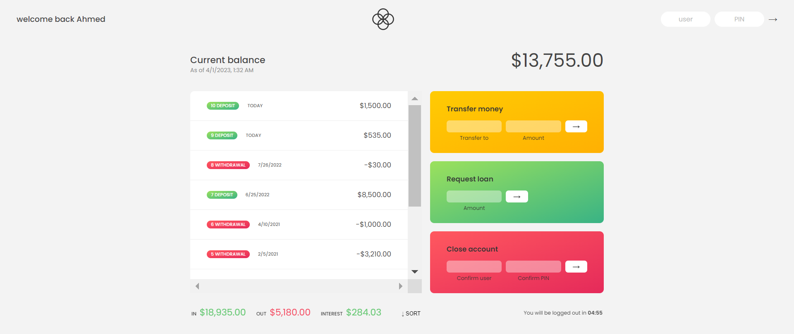

<div id="top"></div>


<!-- PROJECT LOGO -->
<br />
<div align="center">
  <a href="https://modern-bankist.vercel.app/">
    
  </a>
  <h1 align="center">BANKIST - App</h1>

  <p align="center">
    <a href="https://modern-bankist.vercel.app/">View Demo</a>
    ·
    <a href="https://github.com/ahmedalam98/Bankist/issues">Report Bug</a>
  </p>
</div>

<!-- TABLE OF CONTENTS -->
<details>
  <summary>Table of Contents</summary>
  <ol>
    <li>
      <a href="#about-the-project">About The Project</a>
      <ul>
        <li><a href="#built-with">Built With</a></li>
        <li><a href="#flowchart">Logic & Plan (flowchart)</a></li>
      </ul>
    </li>
    <li>
      <a href="#getting-started">Getting Started</a>
      <ul>
        <li><a href="#users">Users</a></li>
        <li><a href="#installation">Installation</a></li>
      </ul>
    </li>
    <li><a href="#contributing">Contributing</a></li>
    <li><a href="#acknowledgments">Acknowledgments</a></li>
  </ol>
</details>

<!-- ABOUT THE PROJECT -->

## About The Project

Simple banking-UserPage for tracking transactions and transfer money to other users and request loans.

**You should use <a href="#users">UserNames</a> to use app features ( Transfer, loan, delete )**



### Flowchart


<p align="right">(<a href="#top">back to top</a>)</p>

### Built With

- HTML
- CSS
- JavaScript

<!-- GETTING STARTED -->

## Getting Started

This project doesn't require any prequesites or dependenscies and you can view it online using this [demo](https://modern-bankist.vercel.app/).

### Users

| Owner             | **UserName** | **Pin** |
| ----------------- | ------------ | ------- |
| Mohamed Ali       | ma           | 1111    |
| Ahmed Ibrahim     | ai           | 2222    |
| Jonas Schmedtmann | js           | 3333    |

> To get a local copy up and running follow these simple steps :

### Installation

1. Clone the repo
   ```sh
   git clone https://github.com/ahmedalam98/Bankist.git
   ```
2. Go to project folder
   ```sh
   cd Bankist_App
   ```
3. open `index.html` file

<p align="right">(<a href="#top">back to top</a>)</p>

<!-- CONTRIBUTING -->

## Contributing

Contributions are what make the open source community such an amazing place to learn, inspire, and create. Any contributions you make are **greatly appreciated**.

If you have a suggestion that would make this better, please fork the repo and create a pull request. You can also simply open an issue with the tag "enhancement".
Don't forget to give the project a star! Thanks!

1. Fork the Project
2. Create your Feature Branch (`git checkout -b feature/AmazingFeature`)
3. Commit your Changes (`git commit -m 'Add some AmazingFeature'`)
4. Push to the Branch (`git push origin feature/AmazingFeature`)
5. Open a Pull Request

<p align="right">(<a href="#top">back to top</a>)</p>

<!-- ACKNOWLEDGMENTS -->

## Acknowledgments

- [Jonas schmedtmann](https://github.com/jonasschmedtmann)
